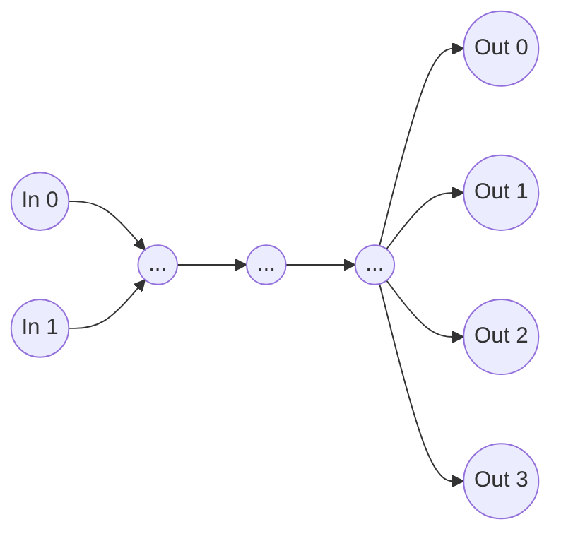
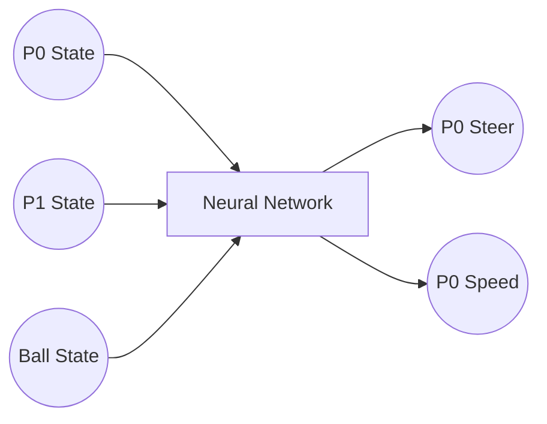

# neurons
Playing around with neural networks

| Inputs               | Description |
| -------------------- | :---------: |
| Player X             | [0 .. Field Width]  |
| Player Y             | [0 .. Field Length] |
| Player Facing Angle  | [0 .. 360]          |
| Player Velocity X    | [-Max Speed .. +MaxSpeed] |
| Player Velocity Y    | [-Max Speed .. +MaxSpeed] |
| Enemy X              | [0 .. Field Width]  |
| Enemy Y              | [0 .. Field Length] |
| Enemy Facing Y       | [0 .. 360]          |
| Enemy Velocity X     | [-Max Speed .. +MaxSpeed] |
| Enemy Velocity Y     | [-Max Speed .. +MaxSpeed] |
| Ball X               | [0 .. Field Width]  |
| Ball Y               | [0 .. Field Length] |
| Ball Velocity X      | [-Max Speed .. +MaxSpeed] |
| Ball Velocity Y      | [-Max Speed .. +MaxSpeed] |

| Outputs              | Description |
| -------------------- | :---------: |
| Player Steering      | [Max Left .. Max Right]  |
| Player Speed         | [Max Reverse .. Max Forward] |
